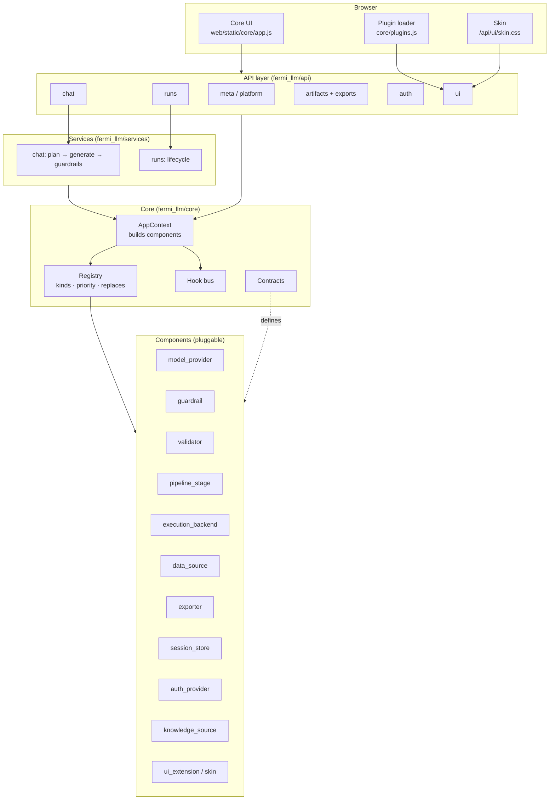
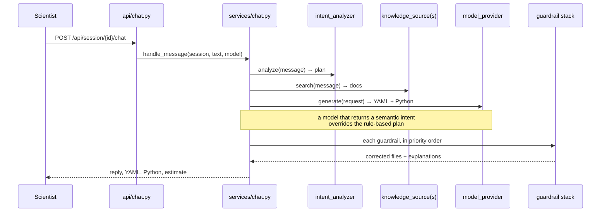
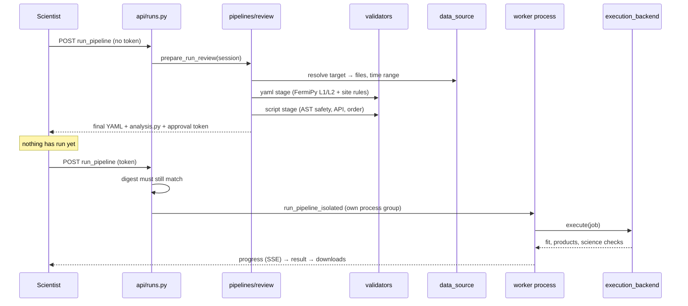
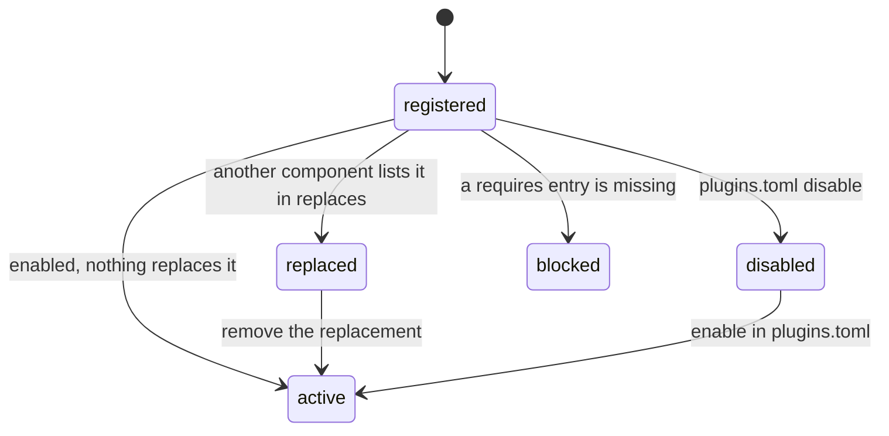

# Architecture

Fermi-LLM turns a plain-English request into a FermiPy analysis: it generates
the configuration and the Python driver, reviews them, runs exactly what was
reviewed, and shows the result. This document explains how that is put
together, and where you plug in.

The whole platform is one rule: **core sequences, components do the work.**
Core owns the registry, the contracts and the request flow. Everything
else — every model, guardrail, validator, exporter, data source, panel and
skin — is a component registered against the same registry, including the
ones that ship in this repository.

## The big picture



Nothing in `components/` imports another component. They meet through
`AppContext`, which is why any one of them can be replaced.

## One chat message



The guardrails are the deterministic layer that makes model output
trustworthy. They run in this order, and each one is a separate component you
can disable, reorder or replace:

| Priority | Component | Fixes |
|---|---|---|
| 100 | `edit_merge` | sections a regenerated file silently dropped |
| 200 | `target_enforcement` | target not the one the scientist named |
| 210 | `target_preservation` | target changed when nobody asked |
| 300 | `product_reconciliation` | requested product has no YAML section |
| 400 | `full_data_defaults` | archive paths and time range for non-bundled targets |
| 500 | `diffuse_paths` | diffuse models pinned to the installed files |

## One run

Running is two clicks, and the second one is a promise: what you approved is
what executes.



## What plugs in where

```mermaid
flowchart LR
    subgraph inbound["Getting requests in"]
        A1["model_provider<br/>a new model or service"]
        A2["intent_analyzer<br/>a different planner"]
        A3["knowledge_source<br/>docs, RAG, catalogs"]
        A4["auth_provider<br/>institutional login"]
    end
    subgraph middle["Deciding what runs"]
        B1["guardrail<br/>consistency rules"]
        B2["validator<br/>safety and site policy"]
        B3["data_source<br/>your archive"]
        B4["pipeline_stage<br/>extra review steps"]
    end
    subgraph outbound["Getting results out"]
        C1["execution_backend<br/>cluster, cloud, container"]
        C2["exporter / importer<br/>formats"]
        C3["session_store<br/>where tasks live"]
        C4["ui_extension / skin<br/>panels and looks"]
        C5["api_extension<br/>your own endpoints"]
    end
    inbound --> middle --> outbound
```



Every arrow in that diagram is a documented contract in
[`module-types.md`](module-types.md).

## Stacking, replacing, removing

The registry gives each component a `priority`, an optional `replaces` list
and an optional `requires` list. From those three facts it computes what is
active:



- **Stack**: register another component of the same kind. Guardrails,
  validators, exporters, data sources and UI extensions all run together.
- **Replace**: register yours with `replaces=("their_name",)`. The original
  stays registered but inactive, so reverting is a config change.
- **Remove**: `disable = ["kind:name"]` in `configs/plugins.toml`.
- **Reorder**: pick a `priority` between the two you want to sit between.
  Core uses round numbers (100, 200, 300…) precisely to leave room.

`GET /api/platform` reports the live result — the answer to "which modules is
this deployment actually running?"

## Where the code lives

```
src/fermi_llm/
├── core/          registry, contracts, hooks, config, loader, context, runtime
├── api/           one router per domain; thin, no business logic
├── services/      orchestration: chat flow, run lifecycle
├── components/    every pluggable module, one package per kind
│   ├── models/        providers/ — one file per backend
│   ├── guardrails/    one file per rule + shared yamlops
│   ├── validators/    FermiPy levels, script review
│   ├── pipelines/     review (approve) and execute (run)
│   ├── execution/     local subprocess backend
│   ├── datasources/   bundled demo data, weekly archive
│   ├── exporters/     notebook, bundle, logs, archive
│   ├── storage/       filesystem session store
│   ├── auth/          google, guest, shared token format
│   ├── knowledge/     documentation search
│   └── ui/            skins, demo prompts
├── fermipy/       the analysis layer (schema, repair, validation, runner)
└── web/static/    core app, plugin loader, skins
```

Two rules keep it that way:

1. **`core/` imports nothing from `components/`.** If core needs a
   capability, it needs a contract, not an import.
2. **A component imports core and its own package only.** Anything shared by
   two components belongs in `core/` or in the analysis layer.

## Design decisions worth knowing

**The frontend has no build step.** Vanilla JS, served as-is, because the
deployment has no bundler and a scientist debugging a panel should be able to
read the file being served. Plugins load through `/api/ui/extensions`.

**A failing plugin never stops the platform.** The loader records the failure
and continues; `/api/platform` reports it. One institute's half-installed
module must not take the instance down for everyone else.

**The reviewed script is executed as written.** The platform proposes, the
user approves, and the approved bytes run — no silent rewrite between review
and execution. Any change to that flow needs a very good reason.

**Session state is a directory.** Everything one task produced lives under
`sessions/<id>/`, which is what makes a task portable and a run reproducible.
